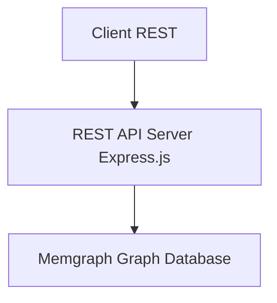

# REST to Memgraph Adapter - System Design (JavaScript)

## Goal

Expose a RESTful API that directly queries a Memgraph graph database, so clients can access data using traditional REST endpoints.

---

## High-Level Architecture



---

##  Components
The system is decomposed into focused layers so query logic, transport, and infrastructure concerns remain isolated and testable.

### 1. REST API Layer (Express.js)
- Defines and documents REST endpoints (e.g. `/sample/by/{field}/count`)
- Handles HTTP concerns: routing, parsing, status codes, paging, filtering
- Delegates all data fetching to the Service layer (no raw Cypher here)

### 2. Service Layer
- Orchestrates one or more repository (data access) calls
- Implements domain logic / aggregations / post-processing
- Converts lower‑level data structures into response DTOs

### 3. Data Access Layer (Memgraph Repository)
- Encapsulates Cypher queries & parameter binding
- Provides reusable functions: `getSampleCountsBy(field)`, etc.
- Central place to optimize queries / add caching hints

### 4. Memgraph Graph Database
- Stores domain entities as nodes & relationships (e.g. `(:Sample)`)
- Queried via Cypher over Bolt protocol

### 5. Caching Layer (Optional)
- Redis (or in‑memory) for hot/read‑heavy aggregation endpoints
- Key strategy: namespaced keys `sample:count:<field>` with TTL

### 6. Validation & Security
- Input validation (Joi / express-validator)
- Rate limiting, CORS, Helmet, auth (future JWT / API key)

### 7. Observability
- Structured logging (winston) with request correlation IDs
- Metrics (Prometheus client) & health/readiness probes

### 8. Configuration & Secrets
- Centralized config module sourcing from environment variables
- Supports environment overlays (dev, test, prod)

### 9. Error Handling
- Normalizes errors to a consistent JSON envelope
- Maps internal exceptions (validation, unsupported field, cypher failure) to proper HTTP codes

---

## 🧰 Tech Stack

| Layer | Technology | Purpose |
|-------|------------|---------|
| Language & Runtime | JavaScript (Node.js) | Server-side logic |
| Web Framework | Express.js | RESTful routing and middleware |
| Graph Database Client | `memgraph-js` (preferred) or `@memgraph/mgclient` | Bolt connectivity & Cypher execution |
| Env Config | dotenv + centralized config module | Manage secrets and endpoints |
| Input Validation | joi or express-validator | Validate REST parameters |
| Caching (optional) | Redis | Cache Cypher query results |
| Logging | winston + morgan (request access logs) | Structured + HTTP logs |
| Metrics (optional) | prom-client | Export Prometheus metrics |
| Documentation | swagger-ui-express or Redoc | REST endpoint docs (OpenAPI) |
| Security | helmet, cors, express-rate-limit | Headers, CORS & abuse protection |
| Testing | Jest + supertest | Unit & integration tests |
| Containerization | Docker | Deployment packaging |
| Linting / Style | eslint, prettier | Code quality & consistency |

---

## API Surface (Derived from `swagger.yml`)

The OpenAPI spec (`swagger.yml`) defines the contract. Core resource groups:

| Group | Endpoints (GET) | Purpose |
|-------|------------------|---------|
| Subject | `/subject`, `/subject/{organization}/{namespace}/{name}`, `/subject/by/{field}/count`, `/subject/summary` | Line-level subject data, retrieval by ID, grouped counts & summary |
| Sample | `/sample`, `/sample/{organization}/{namespace}/{name}`, `/sample/by/{field}/count`, `/sample/summary` | Line-level sample data, retrieval by ID, grouped counts & summary |
| File | `/file`, `/file/{organization}/{namespace}/{name}`, `/file/by/{field}/count`, `/file/summary` | Line-level file metadata & aggregations |
| Metadata Fields | `/metadata/fields/subject`, `/metadata/fields/sample`, `/metadata/fields/file` | Discover supported filterable fields per entity |
| Namespace | `/namespace`, `/namespace/{organization}/{namespace}` | Namespace registry |
| Organization | `/organization`, `/organization/{name}` | Organization registry |
| Info | `/info` | Server info (version, etc.) |
| Experimental | `/sample-diagnosis`, `/subject-diagnosis` | Free‑text diagnosis search extensions |

Cross-cutting behaviors:
1. Pagination & Link headers for list endpoints.
2. Filtering on harmonized & unharmonized fields (`metadata.unharmonized.*`).
3. Grouped counts by arbitrary supported field (`/by/{field}/count`).
4. Summaries returning aggregated metrics (`/summary`).
5. Consistent error envelope (`responses.Errors`).

---

##  Filtering Model → Cypher Translation

List endpoints accept a dynamic set of query parameters representing exact-match filters (case-sensitive) except:
* Multi-value fields: OR semantics across stored values (e.g., `race` array).
* Free-text experimental search (`search` param on experimental endpoints): case-insensitive substring match over designated diagnosis fields.
* Unharmonized fields: prefixed with `metadata.unharmonized.` externally; internally mapped to node property namespace (e.g., property prefix `uh_` or nested map) — design decision: flatten and prefix with `uh__` for indexing ease.

Cypher construction pattern (pseudo):
```text
MATCH (n:Subject)
WHERE allFilters
RETURN n
SKIP $offset LIMIT $limit
```

Dynamic predicate builder (examples):
* Single-valued: `n.vital_status = $vital_status`
* Multi-valued stored as list: `$race IN n.race` OR `ANY(r IN n.race WHERE r = $race)` (choose latter for index usage)
* Unharmonized: `n.uh__<field> = $uh_field`
* Case-insensitive contains (experimental): `ANY(d IN n.associated_diagnoses WHERE toLower(d) CONTAINS toLower($search))`

Sanitization: Allow only whitelisted property names (from metadata fields endpoints) to prevent injection. Reject unknown `field` with 422.

---

## `/by/{field}/count` Endpoints

Logic:
1. Validate `field` is among allowed fields for that entity (subject/sample/file) derived from metadata fields repository.
2. Generate Cypher: `MATCH (n:Sample) WITH n, n.<field> AS k RETURN k AS field, count(*) AS count ORDER BY count DESC`.
3. Null / empty handling: exclude rows where `k IS NULL OR (k = '' AND k <> 0)`.
4. Response shape matches `responses.by.count.<entity>.Results` (array of objects) sorted by count, deterministic tie-breaker (e.g., `field ASC`).

Edge Cases:
* Unsupported field → 422 `UnsupportedField`.
* Field exists but all values null → empty array (200).

---

## 🧮 Pagination & Link Headers

Parameters: `page` (1-based, default 1), `per_page` (default 100 unless overridden via config).

Offset calculation: `offset = (page - 1) * per_page`. Guard: if page < 1 or per_page < 1 → 422 `InvalidParameters`.

Total counting strategies:
1. Standard: `MATCH (n:Entity {filters}) RETURN count(n)` (may be expensive; optionally restrict to `LIMIT (page * per_page + 1)` to infer `next`).
2. Optimization: maintain approximate counts via periodic job (future).

Link header construction (RFC 5988 style):
```
<base?page=1&per_page=100>; rel="first", <base?page=last&per_page=100>; rel="last", <base?page=prev>; rel="prev", <base?page=next>; rel="next"
```
Include only relations applicable per spec requirements.

---

## 🧾 Error Handling Strategy

Unified envelope:
```json
{ "errors": [ { "kind": "InvalidParameters", "parameters": ["page"], "reason": "...", "message": "..." } ] }
```

Mappings:
| Condition | HTTP | kind |
|-----------|------|------|
| Unknown field (count) | 422 | UnsupportedField |
| Invalid `page` / `per_page` | 422 | InvalidParameters |
| Entity not found by ID | 404 | NotFound |
| Data cannot be shared (config) | 404 | UnshareableData |
| Internal exception | 500 | InternalServerError (extension) |

Middleware order: `requestContext` → `validation` → `routes` → `errorHandler` (maps domain errors to spec-compliant envelope).

---

## 🧠 Summary & Aggregation Endpoints (`/summary`)

Each entity summary aggregates selected metrics (defined in `responses.Summary`). Implementation approach:
* Precompute heavy aggregates (optional) using scheduled job writing back to a `Summary` node / in-memory cache.
* Real-time fallback: multiple Cypher subqueries combined with `CALL { ... }` blocks returning a single map.

---

## 🧪 Testing Approach (Spec Alignment)

Test layers:
1. Unit: predicate builder → given filters produce expected Cypher & params.
2. Integration (Memgraph test container): seed minimal graph, exercise endpoints verifying status codes, pagination, Link headers, error kinds.
3. Contract: validate `swagger.yml` & generated OpenAPI (if auto) diff (e.g., `jest-openapi` library) to ensure responses conform.

---

## 🔐 Security & Hardening (Spec-Relevant)
* Rate limiting on high-cardinality endpoints `/subject` & `/sample`.
* Field allowlist eliminates Cypher injection surface.
* Strict JSON parsing & size limits.
* CORS restricted by configuration (allowed origins list).

---

## ♻️ Caching Policy
| Endpoint Type | Cache Scope | TTL | Invalidation |
|---------------|-------------|-----|--------------|
| `/by/{field}/count` | key per entity+field+filter-hash | 10–30 min | Data load batch completion |
| `/summary` | single key per entity | 5–15 min | Data load batch completion |
| List pages | Optional (LRU) for page 1 only | 5 min | On data mutation (future) |

---

## 🏗️ Implementation Phases
1. Bootstrap layers & config + health/metrics.
2. Implement metadata fields repository (drives allowlists).
3. Implement Subject list + count + summary (pattern establishes framework).
4. Extend to Sample, File.
5. Add Namespaces, Organizations, Info.
6. Experimental diagnosis endpoints.
7. Caching & performance optimizations.
8. Contract tests & documentation polishing.

---

---

## �🗂️ Folder Structure
Proposed refactor (aligning with existing folders while removing GraphQL specifics):

```
project-root/
├── app.js                    # Express bootstrap
├── package.json
├── config/
│   ├── index.js              # Aggregated config (env parsing)
│   └── memgraph.js           # Memgraph connection factory
├── db/                       # (Optional: alias 'repository/' or 'data/')
│   └── sampleRepository.js   # Cypher queries for Samples
├── services/
│   └── sampleService.js      # Domain/service logic wrapping repositories
├── routes/
│   ├── index.js              # Mount all route modules
│   └── sample.js             # /sample endpoints (uses service layer)
├── middleware/
│   ├── validation.js
│   ├── rateLimiter.js
│   ├── errorHandler.js
│   └── requestContext.js     # Correlation IDs, per-request metadata
├── cache/                    # (optional)
│   └── redisClient.js        # Redis init + helper functions
├── docs/
│   └── openapi.yaml          # REST API specification
├── tests/
│   ├── sample.test.js
│   ├── health.test.js
│   └── setup.js
├── scripts/                  # Dev & ops scripts (e.g., load sample data)
│   └── seed.js
└── docker/                   # Docker & compose overrides
  └── docker-compose.dev.yml
```

Notes:
- The existing `graphql/` directory can be deprecated; migrate any generic utilities if still useful.
- `db/` focuses on pure data access (no HTTP, no business rules).
- `services/` enforces separation between HTTP layer and Cypher specifics.
- Add `requestContext.js` middleware early to enrich logs (traceability).
- Introduce `openapi.yaml` early to drive contract-first evolution.

---

## 🔄 REST to Cypher Mapping

### Example Mapping Table

| REST Endpoint | Cypher Query (Pseudo) |
|---------------|----------------------|
| `/sample/by/tumor_status/count` | `MATCH (s:Sample) WITH s.tumor_status AS k WHERE k IS NOT NULL RETURN k AS field, count(*) AS count` |
| `/sample/by/anatomical_sites/count` | `MATCH (s:Sample) UNWIND s.anatomical_sites AS k WITH k WHERE k IS NOT NULL RETURN k AS field, count(*) AS count` |
| `/sample/by/tumor_classification/count` | `MATCH (s:Sample) WITH s.tumor_classification AS k WHERE k IS NOT NULL RETURN k AS field, count(*) AS count` |
| `/subject/by/race/count` | `MATCH (n:Subject) UNWIND n.race AS k WITH k WHERE k IS NOT NULL RETURN k AS field, count(*) AS count` |
| `/file/by/type/count` | `MATCH (f:File) WITH f.type AS k WHERE k IS NOT NULL RETURN k AS field, count(*) AS count` |

---

## 📄 sample.js - REST Route

```js
const express = require('express');
const mg = require('@memgraph/mgclient'); // or use memgraph-js
const router = express.Router();

const FIELD_TO_CYPHER_MAP = {
  tumor_status: 'tumor_status',
  anatomic_site: 'anatomic_site',
  tumor_classification: 'tumor_classification',
};

// Create a Memgraph connection pool or client
const client = new mg.Client({
  host: 'localhost',
  port: 7687,
  // user, password if needed
});

router.get('/by/:field/count', async (req, res) => {
  const field = req.params.field;
  const cypherField = FIELD_TO_CYPHER_MAP[field];

  if (!cypherField) {
    return res.status(422).json({
      errors: [
        {
          kind: 'UnsupportedField',
          field,
          reason: `This field is not present for samples.`,
          message: `Field '${field}' is not supported.`,
        },
      ],
    });
  }

  const query = `MATCH (s:Sample) RETURN s.${cypherField} AS field, count(*) AS count`;

  try {
    const result = await client.execute(query);
    // result.records is an array of { field, count }
    return res.json(result.records);
  } catch (err) {
    return res.status(500).json({ message: 'Internal Server Error', details: err.message });
  }
});

module.exports = router;
```

---

## 📄 app.js - Entry Point

```js
const express = require('express');
const sampleRoutes = require('./routes/sample');

const app = express();
app.use(express.json());
app.use('/sample', sampleRoutes);

app.listen(3000, () => {
  console.log('REST adapter running on port 3000');
});
```

---

## 🧪 Example Response

```json
[
  { "field": "Metastatic", "count": 12 },
  { "field": "Primary", "count": 8 }
]
```

---

## ✅ Summary

- Implements full OpenAPI surface from `swagger.yml` across Subjects, Samples, Files & related registries.
- Input filters safely translated into parameterized Cypher.
- Pagination & Link headers conform to spec.
- Consistent error envelope per OpenAPI components.
- Extensible layering (routes → services → repositories) supports new endpoints with minimal duplication.
- Caching & performance optimizations planned but optional for initial MVP.

