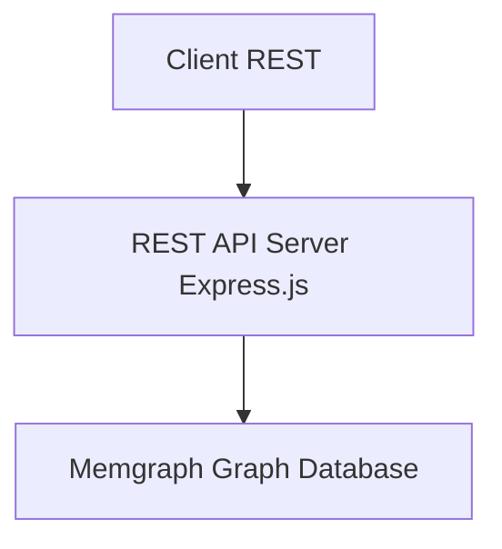

# REST to Memgraph Adapter - System Design (Node.js)

## Goal

Expose a RESTful API that directly queries a Memgraph graph database, so clients can access data using traditional REST endpoints.

---

## High-Level Architecture



---

##  Components
The system is decomposed into focused layers so query logic, transport, and infrastructure concerns remain isolated and testable.

### REST API Layer (Express.js)
- Defines and documents REST endpoints (e.g. `/sample/by/{field}/count`)
- Handles HTTP concerns: routing, parsing, status codes, paging, filtering
- Delegates all data fetching to the Service layer (no raw Cypher here)

### Service Layer
- Orchestrates one or more repository (data access) calls
- Implements domain logic / aggregations / post-processing
- Converts lower‑level data structures into response DTOs

### Data Access Layer (Memgraph Repository)
- Encapsulates Cypher queries & parameter binding
- Provides reusable functions: `getSampleCountsBy(field)`, etc.
- Central place to optimize queries / add caching hints

### Memgraph Graph Database
- Stores domain entities as nodes & relationships (e.g. `(:Sample)`)
- Queried via Cypher over Bolt protocol

### Caching Layer (Optional)
- Redis (or in‑memory) for hot/read‑heavy aggregation endpoints
- Key strategy: namespaced keys `sample:count:<field>` with TTL

### Validation & Security
- Input validation (Joi / express-validator)
- Rate limiting, CORS, Helmet, auth (future JWT / API key)

### Observability
- Structured logging (winston) with request correlation IDs
- Metrics (Prometheus client) & health/readiness probes

### Configuration & Secrets
- Centralized config module sourcing from environment variables
- Supports environment overlays (dev, test, prod)

### Error Handling
- Normalizes errors to a consistent JSON envelope
- Maps internal exceptions (validation, unsupported field, cypher failure) to proper HTTP codes

---

## Tech Stack

| Layer | Technology | Purpose |
|-------|------------|---------|
| Runtime | Node.js (JavaScript) | Server-side logic & dependency ecosystem |
| Web Framework | Express.js | RESTful routing and middleware |
| Graph Database Client | `neo4j-driver` | Bolt connectivity & Cypher execution against Memgraph (direct driver) |
| Env Config | dotenv + centralized config module | Manage secrets and endpoints |
| Input Validation | joi or express-validator | Validate REST parameters |
| Caching (optional) | Redis | Cache Cypher query results |
| Logging | winston + morgan (request access logs) | Structured + HTTP logs |
| Metrics (optional) | prom-client | Export Prometheus metrics |
| Documentation | swagger-ui-express or Redoc | REST endpoint docs (OpenAPI) |
| Security | helmet, cors, express-rate-limit | Headers, CORS & abuse protection |
| Testing | Jest + supertest | Unit & integration tests |
| Containerization | Docker | Deployment packaging |
| Linting / Style | eslint, prettier | Code quality & consistency |

---

## API Surface (Derived from `swagger.yml`)

The OpenAPI spec (`swagger.yml`) defines the contract. Core resource groups:

| Group | Endpoints (GET) | Purpose |
|-------|------------------|---------|
| Subject | `/subject`, `/subject/{organization}/{namespace}/{name}`, `/subject/by/{field}/count`, `/subject/summary` | Line-level subject data, retrieval by ID, grouped counts & summary |
| Sample | `/sample`, `/sample/{organization}/{namespace}/{name}`, `/sample/by/{field}/count`, `/sample/summary` | Line-level sample data, retrieval by ID, grouped counts & summary |
| File | `/file`, `/file/{organization}/{namespace}/{name}`, `/file/by/{field}/count`, `/file/summary` | Line-level file metadata & aggregations |
| Metadata Fields | `/metadata/fields/subject`, `/metadata/fields/sample`, `/metadata/fields/file` | Discover supported filterable fields per entity |
| Namespace | `/namespace`, `/namespace/{organization}/{namespace}` | Namespace registry |
| Organization | `/organization`, `/organization/{name}` | Organization registry |
| Info | `/info` | Server info (version, etc.) |
| Experimental | `/sample-diagnosis`, `/subject-diagnosis` | Free‑text diagnosis search extensions |

Cross-cutting behaviors:
1. Pagination & Link headers for list endpoints.
2. Filtering on harmonized & unharmonized fields (`metadata.unharmonized.*`).
3. Grouped counts by arbitrary supported field (`/by/{field}/count`).
4. Summaries returning aggregated metrics (`/summary`).
5. Consistent error envelope (`responses.Errors`).

---

##  Filtering Model

List endpoints support exact-match filtering (case-sensitive) across harmonized and unharmonized fields, multi-value fields apply OR semantics within the field, experimental diagnosis endpoints apply case-insensitive substring matching, and an allowlist prevents unsupported field usage.

---

## `/by/{field}/count` Endpoints

Count endpoints group entities by a validated field and return frequency distributions, excluding null or empty values, and respond with 422 for unsupported fields.

---

## Pagination & Link Headers

Parameters: `page` (1-based, default 1), `per_page` (default 100 unless overridden via config).

Offset calculation: `offset = (page - 1) * per_page`. Guard: if page < 1 or per_page < 1 → 422 `InvalidParameters`.

Total counting strategies:
1. Standard: `MATCH (n:Entity {filters}) RETURN count(n)` (may be expensive; optionally restrict to `LIMIT (page * per_page + 1)` to infer `next`).
2. Optimization: maintain approximate counts via periodic job (future).

Link header construction (RFC 5988 style):
```
<base?page=1&per_page=100>; rel="first", <base?page=last&per_page=100>; rel="last", <base?page=prev>; rel="prev", <base?page=next>; rel="next"
```
Include only relations applicable per spec requirements.

---

## Error Handling Strategy

Unified envelope:
```json
{ "errors": [ { "kind": "InvalidParameters", "parameters": ["page"], "reason": "...", "message": "..." } ] }
```

Mappings:
| Condition | HTTP | kind |
|-----------|------|------|
| Unknown field (count) | 422 | UnsupportedField |
| Invalid `page` / `per_page` | 422 | InvalidParameters |
| Entity not found by ID | 404 | NotFound |
| Data cannot be shared (config) | 404 | UnshareableData |
| Internal exception | 500 | InternalServerError (extension) |

Middleware order: `requestContext` → `validation` → `routes` → `errorHandler` (maps domain errors to spec-compliant envelope).

---

## Summary & Aggregation Endpoints (`/summary`)

Each entity summary aggregates selected metrics (defined in `responses.Summary`). Implementation approach:
* Precompute heavy aggregates (optional) using scheduled job writing back to a `Summary` node / in-memory cache.
* Real-time fallback: multiple Cypher subqueries combined with `CALL { ... }` blocks returning a single map.

---

## Testing Approach (Spec Alignment)

Test layers:
1. Unit: predicate builder → given filters produce expected Cypher & params.
2. Integration (Memgraph test container): seed minimal graph, exercise endpoints verifying status codes, pagination, Link headers, error kinds.
3. Contract: validate `swagger.yml` & generated OpenAPI (if auto) diff (e.g., `jest-openapi` library) to ensure responses conform.

---

## Security & Hardening (Spec-Relevant)
* Rate limiting on high-cardinality endpoints `/subject` & `/sample`.
* Field allowlist eliminates Cypher injection surface.
* Strict JSON parsing & size limits.
* CORS restricted by configuration (allowed origins list).

---

## Caching Policy
| Endpoint Type | Cache Scope | TTL | Invalidation |
|---------------|-------------|-----|--------------|
| `/by/{field}/count` | key per entity+field+filter-hash | 10–30 min | Data load batch completion |
| `/summary` | single key per entity | 5–15 min | Data load batch completion |
| List pages | Optional (LRU) for page 1 only | 5 min | On data mutation (future) |

---

## Implementation Phases
1. Bootstrap layers & config + health/metrics.
2. Implement metadata fields repository (drives allowlists).
3. Implement Subject list + count + summary (pattern establishes framework).
4. Extend to Sample, File.
5. Add Namespaces, Organizations, Info.
6. Experimental diagnosis endpoints.
7. Caching & performance optimizations.
8. Contract tests & documentation polishing.

---

---

## Folder Structure
Refined structure including all API endpoint domains from the OpenAPI specification.

```
project-root/
├── app.js                              # Express bootstrap
├── package.json
├── config/
│   ├── index.js                        # Aggregated config (env parsing, defaults)
│   ├── memgraphDriver.js               # neo4j-driver (Memgraph) singleton factory
│   └── logger.js                       # Winston logger configuration
├── db/                                 # Data access (repositories) – pure Cypher
│   ├── subjectRepository.js            # Subject queries (list, show, counts, summary)
│   ├── sampleRepository.js             # Sample queries
│   ├── fileRepository.js               # File queries
│   ├── metadataRepository.js           # Field allowlists & metadata field listings
│   ├── namespaceRepository.js          # Namespace retrieval
│   ├── organizationRepository.js       # Organization retrieval
│   ├── infoRepository.js               # Server info (version, build data)
│   └── diagnosisRepository.js          # Experimental diagnosis search logic
├── services/                           # Domain orchestration / business logic
│   ├── subjectService.js
│   ├── sampleService.js
│   ├── fileService.js
│   ├── metadataService.js
│   ├── namespaceService.js
│   ├── organizationService.js
│   ├── infoService.js
│   └── diagnosisService.js             # Wraps experimental endpoints
├── routes/                             # HTTP layer (validation + mapping to services)
│   ├── index.js                        # Aggregates and mounts all routers
│   ├── subject.js                      # /subject, /subject/{...}, /subject/by/{field}/count, /subject/summary
│   ├── sample.js                       # /sample, /sample/{...}, /sample/by/{field}/count, /sample/summary
│   ├── file.js                         # /file, /file/{...}, /file/by/{field}/count, /file/summary
│   ├── metadata.js                     # /metadata/fields/{entity}
│   ├── namespace.js                    # /namespace, /namespace/{organization}/{namespace}
│   ├── organization.js                 # /organization, /organization/{name}
│   ├── info.js                         # /info
│   ├── subjectDiagnosis.js             # /subject-diagnosis (experimental)
│   └── sampleDiagnosis.js              # /sample-diagnosis (experimental)
├── middleware/
│   ├── validation.js                   # Schema-based query/path validation
│   ├── rateLimiter.js                  # express-rate-limit configuration
│   ├── errorHandler.js                 # Normalizes thrown errors to spec envelope
│   ├── requestContext.js               # Correlation IDs, timing, logging context
│   └── pagination.js                   # Common pagination parsing & Link header builder
├── cache/
│   ├── redisClient.js                  # Redis initialization
│   └── cacheKeys.js                    # Deterministic key builders (counts, summary)
├── lib/                                # Shared utilities (avoid circular deps)
│   ├── cypherBuilder.js                # Dynamic WHERE / count query generation
│   ├── fieldAllowlist.js               # Loads + caches allowable filter/aggregation fields
│   └── errorTypes.js                   # Custom error classes (UnsupportedField, etc.)
├── docs/
│   ├── openapi.yaml                    # REST API specification (source of truth)
│   └── design/                         # Additional architecture notes (optional)
├── tests/
│   ├── integration/
│   │   ├── subject.int.test.js
│   │   ├── sample.int.test.js
│   │   ├── file.int.test.js
│   │   ├── metadata.int.test.js
│   │   ├── namespace.int.test.js
│   │   ├── organization.int.test.js
│   │   ├── info.int.test.js
│   │   └── diagnosis.int.test.js
│   ├── unit/
│   │   ├── cypherBuilder.test.js
│   │   ├── fieldAllowlist.test.js
│   │   └── pagination.test.js
│   └── setup.js                        # Jest global setup (Memgraph container, env)
├── scripts/
│   ├── seed.js                         # Load seed data into Memgraph
│   ├── build-openapi.js                # (Optional) validation or bundling of spec
│   └── generate-allowlist.js           # Derive allowlist from openapi -> fieldAllowlist
├── docker/
│   ├── docker-compose.dev.yml
│   └── memgraph.conf                   # Custom Memgraph config (if needed)
├── .env.example                        # Example environment configuration
└── README.md                           # Project overview & quick start
```

Notes:
- Each repository exposes only pure data access functions returning plain objects.
- Services layer composes repositories, applies business logic & caching.
- Route modules stay thin: validation → service call → response mapping.
- `fieldAllowlist.js` hydrated at startup (from metadataRepository or static file) to validate `/by/{field}/count` and filter params.
- Experimental endpoints placed with explicit naming to allow easy isolation or removal.

---

<!-- REST to Cypher Mapping section intentionally removed (implementation detail not required) -->

---

<!-- Sample route implementation removed (implementation detail not required) -->

---

<!-- App entry point implementation removed (implementation detail not required) -->

---

<!-- Example response removed (implementation detail not required) -->

---

## Summary

- Implements full OpenAPI surface from `swagger.yml` across Subjects, Samples, Files & related registries.
- Input filters safely translated into parameterized Cypher.
- Pagination & Link headers conform to spec.
- Consistent error envelope per OpenAPI components.
- Extensible layering (routes → services → repositories) supports new endpoints with minimal duplication.
- Caching & performance optimizations planned but optional for initial MVP.

