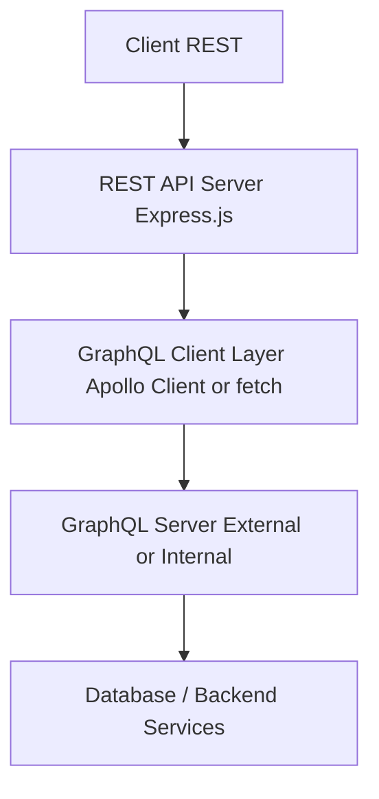

# GraphQL to REST Adapter - System Design (JavaScript)

## 🧩 Goal

Convert a GraphQL API into a RESTful API so that clients who do not support GraphQL can access data using traditional REST endpoints.

---

## 🏗️ High-Level Architecture



---

## 📦 Components

### 1. REST API Server (Express.js)
- Hosts REST endpoints like `/sample/by/{field}/count`
- Translates REST calls into GraphQL queries

### 2. GraphQL Client Layer
- Sends GraphQL queries using `node-fetch`, `axios`, or `graphql-request`

### 3. GraphQL Backend
- Your existing GraphQL API server that exposes structured biomedical data

---

## 🧰 Tech Stack

| Layer | Technology | Purpose |
|-------|------------|---------|
| Language & Runtime | JavaScript (Node.js) | Server-side logic |
| Web Framework | Express.js | RESTful routing and middleware |
| GraphQL Client | node-fetch or graphql-request | Send GraphQL requests |
| Env Config | dotenv | Manage secrets and endpoints |
| Input Validation | joi or express-validator | Validate REST parameters |
| Caching (optional) | Redis | Cache GraphQL responses |
| Logging | winston, morgan | Debugging and traceability |
| Documentation | swagger-ui-express | REST endpoint docs |
| Security | helmet, cors | HTTP header protection and CORS |

---

## 🗂️ Folder Structure

```
graphql-to-rest/
├── routes/
│   └── sample.js
├── graphql/
│   └── queries.js
├── app.js
└── package.json
```

---

## 🔄 REST to GraphQL Mapping

### Example Mapping Table

| REST Endpoint | GraphQL Field |
|---------------|----------------------------|
| `/sample/by/tumor_status/count` | `samplesByTumorStatus` |
| `/sample/by/anatomic_site/count` | `samplesByAnatomicSite` |
| `/sample/by/tumor_classification/count` | `samplesByTumorClassification` |

---

## 📄 sample.js - REST Route

```js
const express = require('express');
const fetch = require('node-fetch');
const router = express.Router();

const GRAPHQL_URL = 'https://your-graphql-api.com/graphql';

const FIELD_TO_QUERY_MAP = {
  tumor_status: 'samplesByTumorStatus',
  anatomic_site: 'samplesByAnatomicSite',
  tumor_classification: 'samplesByTumorClassification',
};

router.get('/by/:field/count', async (req, res) => {
  const field = req.params.field;
  const gqlField = FIELD_TO_QUERY_MAP[field];

  if (!gqlField) {
    return res.status(422).json({
      errors: [
        {
          kind: 'UnsupportedField',
          field,
          reason: `This field is not present for samples.`,
          message: `Field '${field}' is not supported.`,
        },
      ],
    });
  }

  const query = `
    query {
      ${gqlField} {
        field
        count
      }
    }
  `;

  try {
    const response = await fetch(GRAPHQL_URL, {
      method: 'POST',
      headers: { 'Content-Type': 'application/json' },
      body: JSON.stringify({ query }),
    });

    const { data, errors } = await response.json();
    if (errors) return res.status(500).json({ errors });

    return res.json(data[gqlField]);
  } catch (err) {
    return res.status(500).json({ message: 'Internal Server Error', details: err.message });
  }
});

module.exports = router;
```

---

## 📄 app.js - Entry Point

```js
const express = require('express');
const sampleRoutes = require('./routes/sample');

const app = express();
app.use(express.json());
app.use('/sample', sampleRoutes);

app.listen(3000, () => {
  console.log('REST adapter running on port 3000');
});
```

---

## 🧪 Example Response

```json
[
  { "field": "Metastatic", "count": 12 },
  { "field": "Primary", "count": 8 }
]
```

---

## ✅ Summary

- Clients call `/sample/by/{field}/count`
- Your Express.js server translates the call into a GraphQL query
- The GraphQL response is returned as REST JSON
- Easily extendable to support more fields and queries

